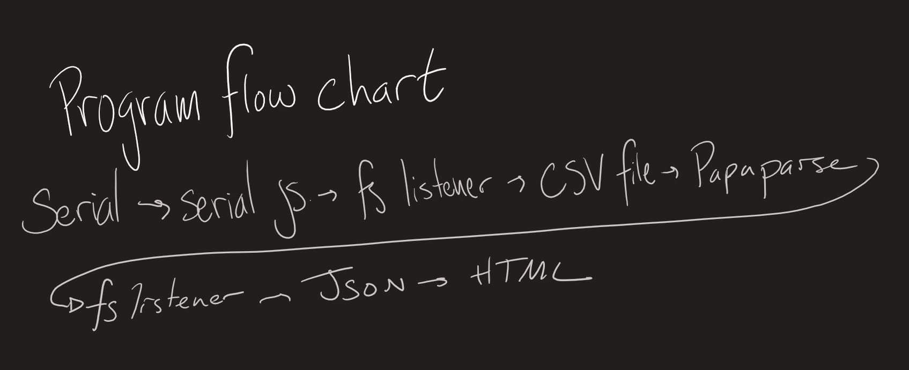
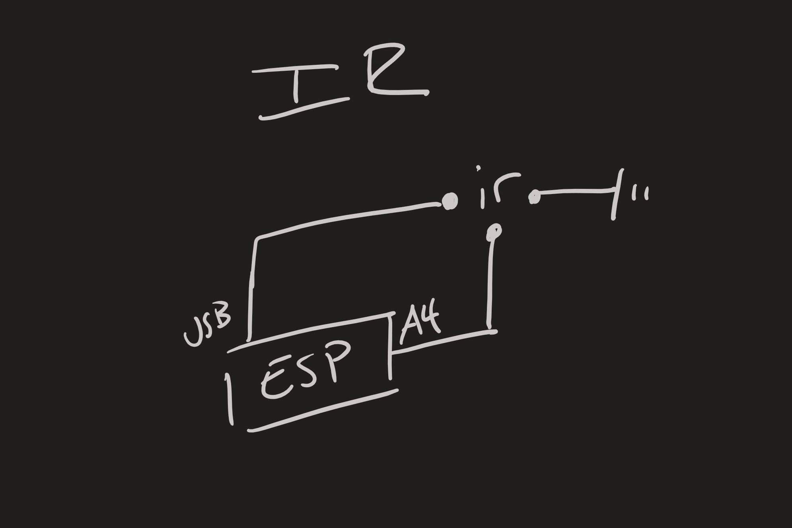
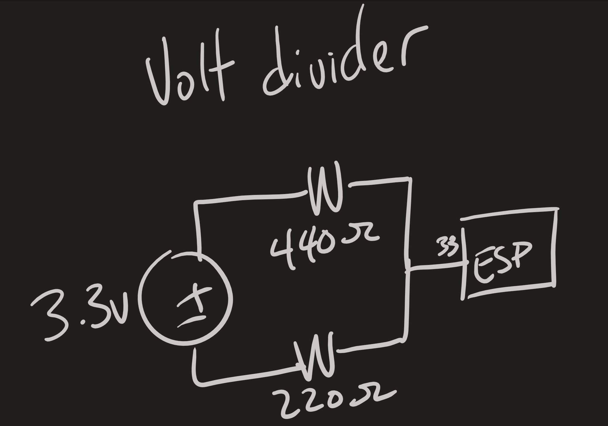
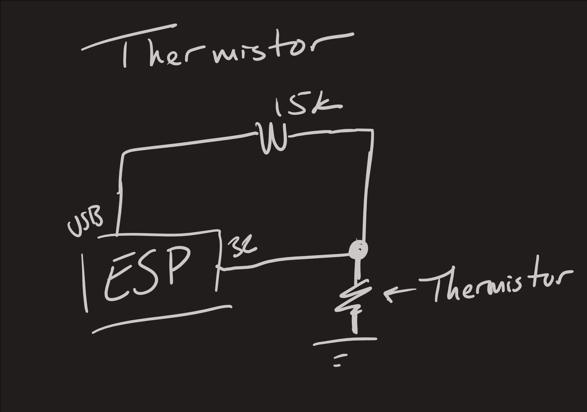
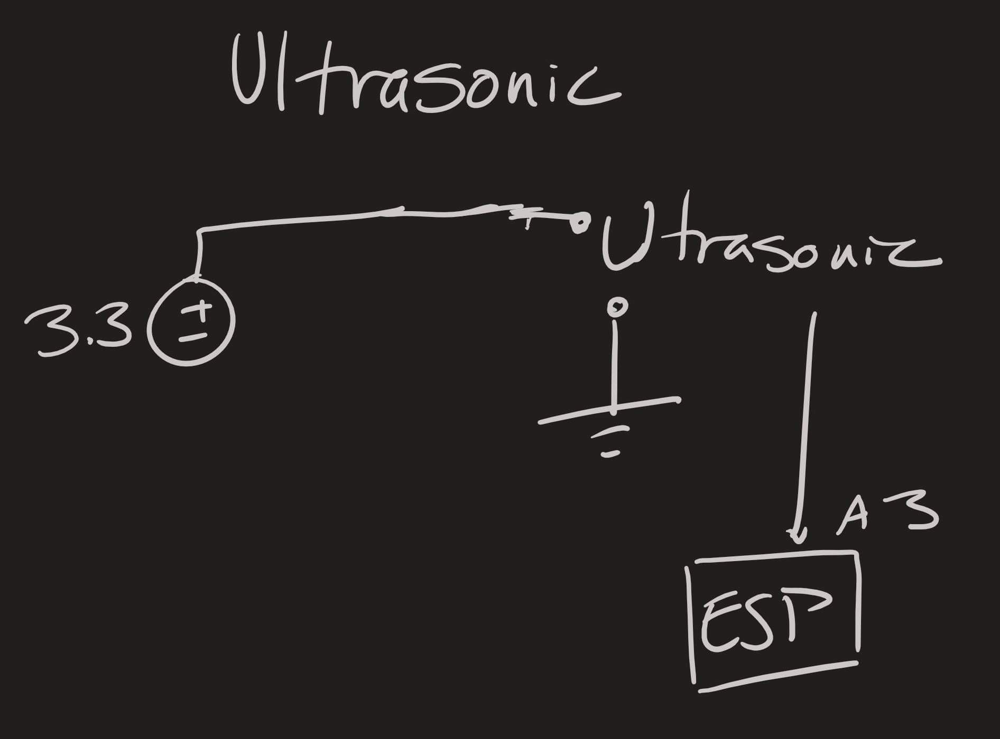

# Sensor Central
Authors: SeungYeun Lee, Rene Colato, Edward Hong

2019-10-08

**Updated on 11/24/2019**

## Summary
The goal of this quest is to use ultrasonic and IR sensor to display
the measured values on a GUI. We combined all the previous skill sets
in order to complete this quest. We were able to successfully
display the measured values on the screen, and plot those values
on a HTML using CanvasJS.

## Investigative Question
Each sensor is able to read data in the magnitude of milliseconds, so it would be reasonable to expect that the data is sampled within several milliseconds, most closely being the sensor that takes the longest to obtain and transmit data. the resolution of each sample varies based on the sensor, the ultrasonic is very good for medium and long distances, while the IR sensors struggles to maintain accuracy from close and far range. The thermistor is relatively accurate with sampling temperature, only it takes time for the reading to stabilize to new temperatures, but the voltage divider is consistent and accurate sampling the quickest of the four.

## Evaluation Criteria
Each sensor are able to measure distance and temperature. Both ultrasonic sensor and IR range sensor uses meters to measure distance, and thermistor sensor uses celsius to measure temperature. Our sensors may be inaccurate because of certain threshold it has in the system itself. We were able to successfully graph based on resulted values from these sensors; however, we were not able to graph them continuously with real-time data.

## Solution Design
*The picture below is a circuit for this quest.*

  

 

*This is our solution*

  

 

## Sketches and Photos

*Here are circuit diagrams for each sensors.*

  

 

  

 

  

 

  

 

## Supporting Artifacts
- [Link to repo](https://github.com/BU-EC444/Team1-Lee-Hong-Colato/tree/rene-retro/quest-2/code)
- [Link to video demo](https://www.youtube.com/watch?v=qwXYtFfDGjk&feature=youtu.be)

## References
- [w3schools.com](https://www.w3schools.com/)
- [Papa Parse](https://www.papaparse.com/)
