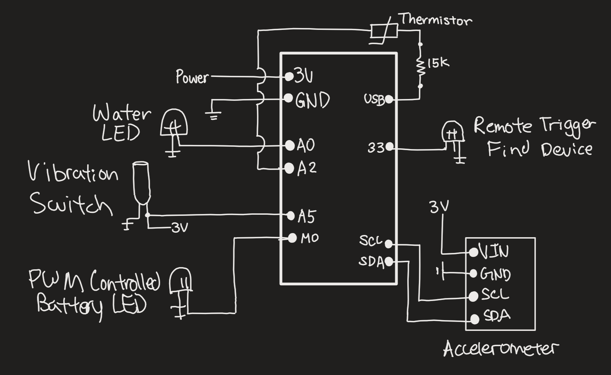
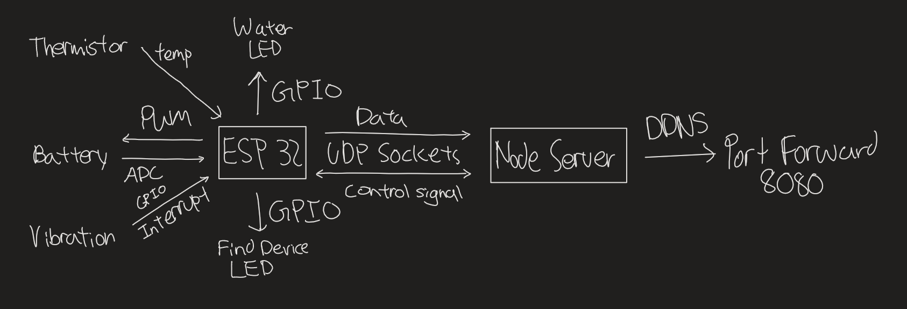
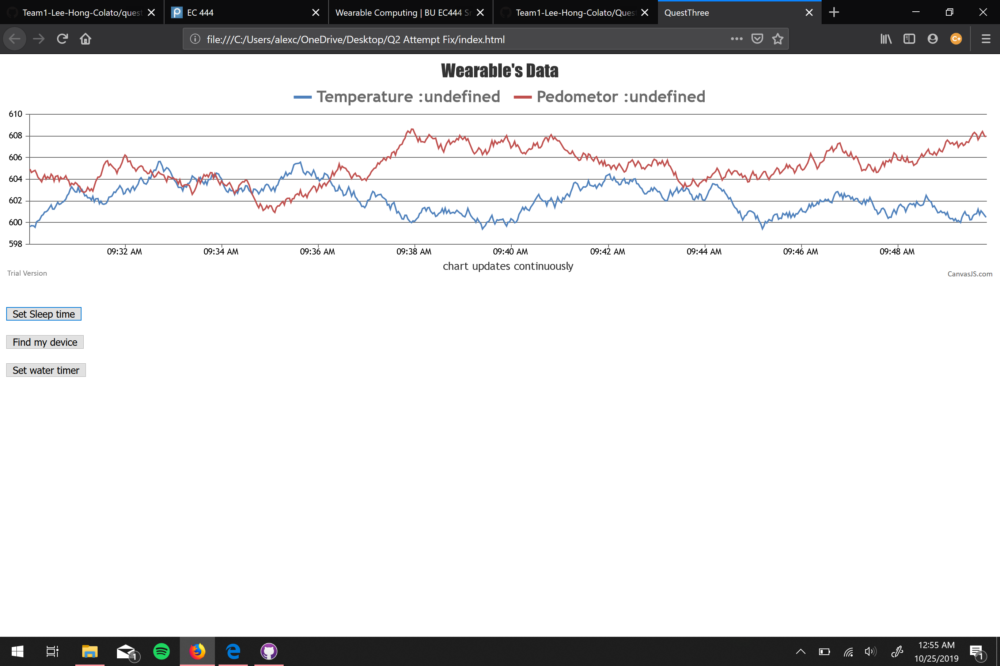

# Sensor Central
Authors: SeungYeun Lee, Rene Colato, Edward Hong

2019-10-24

*Updated on 11/24/2019*
  **Evaluation Criteria:**
    - Pedometer: Originally implemented with a vibration switch but later opted to using the accelerometer
    - Body Temperature: Reading ADC value of thermistor to generate body temperature data
    - Battery Level: Reading ADC value of voltage divider to determine battery level to display on PWM controlled LED, battery level changes intensity of LED
    - Alert (Water): Timer that goes off every **X** seconds, default to an hour but can change depending on what gets received from the UDP socket
    - Alert (Find Wearable): Blinking sequence that wont stop until user triggers vibration switch, blinking starts only when UDP socket sends instructions to blink
    - Remote Access to Turn Off Features: ESP32 has a UDP socket linked to the Node server, which sends data and receives instructions from the server
    - Front End Access: HTML hosted by Node server to show a graph made by CanvasJS. Data that gets plotted on the graph is updated realtime, data points are sent from ESP to Node Server through UDP and from Node to HTML through Socket.IO.

    **Solution Design:**
    **Code Setup**
          The code is arranged so every feature is an RTOS non-blocking task, this helps the readability of the code and further addition on the code in the future. The code is mostly a combination of all the skills that were involved and properly arranged. The UDP portion was customized to send data and receive instructions that gets parsed to control the ESP32's features.

    **Node Server Setup**
          Our first attempt at the Node server is heavily based off of the provided code from the UDP skill, where we mainly use dgram to send and receive data.

    **Client Interface Setup**
          The client interface has a graph made from CanvasJS, it graphs the sensor data whenever the Socket.IO emits the data to the front end. The interface also has button elements that emits events when triggered.

    **Updated Demo Link:**
        [Link to video demo](https://www.youtube.com/watch?v=yQ8gxWecsyQ&feature=youtu.be)

    **Updated Code**
          [Link to code](https://github.com/BU-EC444/Team1-Lee-Hong-Colato/tree/master/quest-3/update)

## Summary
The goal of this quest is to build a wearable device that record biometrics and reports back to a central graphical hub. For our design, we have a functional ESP32 that communicates with a node server through a two-way UDP socket. The ESP32 can send data to the server while the server can control the ESP32's behavior. The project lacks a front-end interface to interact with so the project has to be controlled by hardcoding inputs in the node server. All expected function of the ESP32 are properly implemented.

## Investigative Question
*What are steps you can take to make your device and system low power? Please cite sources for you answer.*
      Some steps that we can take to make the device more low power is to run the device at a lower clock rate. Most of the biometric data that our wearable provides is evaluated every second, to save power, we can make it so it evaluates every 3 second or more. This can be done on functions with data that fluctuates less, like body temperature.
      Furthermore, a sleep mode can be implemented where the device can turn off certain features to save power, since a user wont be paying attention to the wearable every second. Once the user loses focus on the device, certain display features should go offline to save power.

## Evaluation Criteria
**Criteria Met**
    1. Implementing key features of the wearable:
        Pedometer: Originally implemented with a vibration switch but later opted to using the accelerometer
        Body Temperature: Reading ADC value of thermistor to generate body temperature data
        Battery Level: Reading ADC value of voltage divider to determine battery level to display on PWM controlled LED, battery level changes intensity of LED
        Alert (Water): Timer that goes off every **X** seconds, default to an hour but can change depending on what gets received from the UDP socket
        Alert (Find Wearable): Blinking sequence that wont stop until user triggers vibration switch, blinking starts only when UDP socket sends instructions to blink
        Remote Access to Turn Off Features: ESP32 has a UDP socket linked to the Node server, which sends data and receives instructions from the server

**Criteria Not Met**
    Our project lacks a front-end interface for the user to control, it does not have CanvasJS implemented to graph the data it receives. It lacks an online portal to interface the various settings of the ESP32.

## Solution Design
### Roadmap to Completion
**Code Setup**
      The code is arranged so every feature is an RTOS non-blocking task, this helps the readability of the code and further addition on the code in the future. The code is mostly a combination of all the skills that were involved and properly arranged. The UDP portion was customized to send data and receive instructions that gets parsed to control the ESP32's features.

**Node Server Setup**
      Our first attempt at the Node server is heavily based off of the provided code from the UDP skill, where we mainly use dgram to send and receive data.

**Client Interface Setup**
      The client interface that is submitted has basic features, the CanvasJS graph that will graph the received data and button elements that emits events when triggered. Although we have all the elements, our group ran out of time trying to figure out how to let the client communicate with the Node server.
      Unfortunately, we could not figure out how to implement the front end because of issues with Sockets where we ran into bugs that we could not resolve. Problems that were persistent in Quest 2 wasn’t resolved in time so all the confusion carried over taking up a lot of time and effort. We ran into problems programming the accelerometer because there were problems reading the right data and writing to the correct registers. We had problems setting up the router which two days of class time because the DNS and port forwarding segments were mishandled which delayed work on the quest.
      We struggled to use agile software properly because the last couple days became a scramble to produce results which resulted in inefficient uses of time and some phases of the development had to be redone completely or reworked significantly.
## Future Development
For the future, we hope to understand how the front end code works, specifically solving the issue about socket.io (we are planning on meeting up with Professor Little or other TAs for help). Another area we would like to focus in the future is better understanding of how client communicates with sockets.

## Sketches and Photos
Circuit Setup:

  

Circuit Diagram:

  

Design Flow:

  

Front End:
NOTE: data that are shown on the screenshot is NOT the data that we are getting from esp32. We just have dummy data to show that this front end is functional. We never it to get the data from esp32 with socket.io

  

 

## Supporting Artifacts
- [Link to code](https://github.com/BU-EC444/Team1-Lee-Hong-Colato/tree/master/quest-3/code)
- [Link to video demo](https://www.youtube.com/watch?v=JNS3gFbGoHY&feature=youtu.be)

## References
- [Tomato](http://www.polarcloud.com/tomato)
- [DDNS: No-IP](https://www.noip.com/sign-up?dyn-customers&gclid=Cj0KCQjwl8XtBRDAARIsAKfwtxCjnLU50E9PlHlIspuXRDdnTsCMP2qzXG_Y4Jf3c6EWzMrhiHHTTrYaAg_MEALw_wcB)
- [ESP-IDF UDP Socket](https://github.com/espressif/esp-idf/tree/master/examples/protocols/sockets)
- [ESP32 GPIO Interrupt Code Example](https://github.com/espressif/esp-idf/tree/master/examples/peripherals/gpio)
- [ADXL343 Datasheet](https://cdn-learn.adafruit.com/assets/assets/000/070/556/original/adxl343.pdf?1549287964)
- [Adafruit Learn Guide](https://learn.adafruit.com/adxl343-breakout-learning-guide/overview)
- [Tilt Sensing](https://wiki.dfrobot.com/How_to_Use_a_Three-Axis_Accelerometer_for_Tilt_Sensing)
- [CanvasJS](https://canvasjs.com/)
- [Socket.io Get Started](https://socket.io/get-started/chat/)
-----

## Reminders

- Video recording in landscape not to exceed 90s
- Each team member appears in video
- Make sure video permission is set accessible to the instructors
- Repo is private
